# Software Design Specification (SDS)
## GitHub Copilot Seminar Registration System

**Version:** 1.0  
**Date:** February 20, 2026  
**Project:** GitHub Copilot Workshop Registration Platform

---

## 📋 Table of Contents

1. [Introduction](#1-introduction)
2. [System Overview](#2-system-overview)
3. [System Architecture](#3-system-architecture)
4. [Database Design](#4-database-design)
5. [Component Design](#5-component-design)
6. [API Design](#6-api-design)
7. [Sequence Diagrams](#7-sequence-diagrams)
8. [Deployment Architecture](#8-deployment-architecture)
9. [Security Design](#9-security-design)

---

## 1. Introduction

### 1.1 Purpose
This document describes the software design for the GitHub Copilot Seminar Registration System, a web-based platform for managing seminar registrations with capacity management, email notifications, and administrative dashboard.

### 1.2 Scope
The system provides:
- Public registration interface
- Real-time capacity tracking
- Email confirmation system
- Registration status checking
- Administrative dashboard with analytics and data export

### 1.3 Technology Stack
- **Frontend:** Next.js 14 (React 18, TypeScript)
- **Backend:** Next.js API Routes
- **Database:** PostgreSQL (Supabase)
- **ORM:** Prisma
- **Styling:** Tailwind CSS
- **Email:** Resend
- **Hosting:** Vercel
- **Design Pattern:** Atomic Design

---

## 2. System Overview

### 2.1 System Context Diagram


### 2.2 High-Level Features


---

## 3. System Architecture

### 3.1 Overall Architecture


### 3.2 Atomic Design Architecture


---

## 4. Database Design

### 4.1 Entity Relationship Diagram


### 4.2 Database Schema Details


### 4.3 Indexes and Constraints


---

## 5. Component Design

### 5.1 Component Hierarchy

```mermaid
graph TD
    ROOT[App Root]
    
    ROOT --> LAYOUT[Layout]
    ROOT --> PAGES[Pages]
    
    PAGES --> HOME[/ Home]
    PAGES --> SUCCESS[/success]
    PAGES --> CHECK[/check]
    PAGES --> ADMIN[/admin]
    
    HOME --> REG_TEMP[RegistrationTemplate]
    REG_TEMP --> REG_FORM[RegistrationForm]
    REG_TEMP --> CAP_IND[CapacityIndicator]
    
    REG_FORM --> FORM_FIELD1[FormField: Name]
    REG_FORM --> FORM_FIELD2[FormField: Email]
    REG_FORM --> FORM_FIELD3[FormField: Phone]
    REG_FORM --> FORM_FIELD4[FormField: Organization]
    REG_FORM --> BUTTON[Button: Submit]
    
    FORM_FIELD1 --> LABEL[Label]
    FORM_FIELD1 --> INPUT[Input]
    FORM_FIELD1 --> ALERT[AlertBox]
    
    CAP_IND --> PROGRESS[ProgressBar]
    CAP_IND --> TEXT[Text]
    
    style ROOT fill:#fff3e0
    style PAGES fill:#e8f5e9
    style REG_FORM fill:#e1f5fe
    style FORM_FIELD1 fill:#f3e5f5
    style LABEL fill:#ffebee
```

### 5.2 Component Communication


---

## 6. API Design

### 6.1 API Architecture


### 6.2 API Endpoints Specification


---

## 7. Sequence Diagrams

### 7.1 Registration Flow

```mermaid
sequenceDiagram
    actor User
    participant UI as Registration Form
    participant API as API Route
    participant Val as Validator
    participant DB as Database
    participant Email as Email Service
    
    User->>UI: Enter registration details
    User->>UI: Click "ลงทะเบียน"
    
    UI->>UI: Validate form (react-hook-form + Zod)
    
    alt Validation fails
        UI-->>User: Show error messages
    else Validation success
        UI->>API: POST /api/register
        
        API->>Val: Validate input (Zod)
        Val-->>API: Valid
        
        API->>DB: Check seminar exists
        DB-->>API: Seminar found
        
        API->>DB: Check capacity
        
        alt Capacity full
            DB-->>API: Full
            API-->>UI: 400 - Capacity full
            UI-->>User: Show error
        else Capacity available
            API->>DB: Check duplicate email
            
            alt Email exists
                DB-->>API: Exists
                API-->>UI: 400 - Already registered
                UI-->>User: Show error
            else New registration
                API->>DB: Create registration
                API->>DB: Increment counter
                DB-->>API: Registration created
                
                API->>Email: Send confirmation
                Email-->>API: Sent (async)
                
                API-->>UI: 201 - Success + ID
                UI->>UI: Redirect to /success?id=xxx
                UI-->>User: Show success page
            end
        end
    end
```



### 7.2 Check Status Flow

```mermaid
sequenceDiagram
    actor User
    participant UI as Check Page
    participant API as API Route
    participant DB as Database
    
    User->>UI: Visit /check
    UI-->>User: Show search form
    
    User->>UI: Enter email
    User->>UI: Click "ค้นหา"
    
    UI->>API: GET /api/check?email=xxx
    API->>API: Validate email format
    
    alt Invalid email
        API-->>UI: 400 - Invalid input
        UI-->>User: Show error
    else Valid email
        API->>DB: Find by email (lowercase)
        
        alt Not found
            DB-->>API: Null
            API-->>UI: 404 - Not found
            UI-->>User: "ไม่พบข้อมูล"
        else Found
            DB-->>API: Registration data
            API-->>UI: 200 - Registration details
            UI-->>User: Show registration info
        end
    end
```



### 7.3 Admin Authentication Flow

```mermaid
sequenceDiagram
    actor Admin
    participant UI as Admin Layout
    participant API as Auth API
    participant Cookie as Browser Cookie
    participant Dashboard as Admin Page
    
    Admin->>UI: Visit /admin
    UI->>Cookie: Check auth cookie
    
    alt No cookie
        UI-->>Admin: Show password prompt
        Admin->>UI: Enter password
        UI->>API: POST /api/admin/auth
        API->>API: Compare with ADMIN_PASSWORD
        
        alt Incorrect password
            API-->>UI: 401 - Unauthorized
            UI-->>Admin: "รหัสผ่านไม่ถูกต้อง"
        else Correct password
            API->>Cookie: Set auth=true (httpOnly)
            API-->>UI: 200 - Success
            UI->>Dashboard: Render dashboard
            Dashboard-->>Admin: Show data
        end
    else Has cookie
        UI->>Dashboard: Render dashboard
        Dashboard-->>Admin: Show data
    end
```



### 7.4 Admin Data Export Flow


---

## 8. Deployment Architecture

### 8.1 Deployment Diagram


### 8.2 Infrastructure Components

```mermaid
graph LR
    subgraph "DNS"
        DNS[Vercel DNS]
    end
    
    subgraph "CDN & Edge"
        CDN[Global CDN]
        SSL[SSL/TLS Certificates]
    end
    
    subgraph "Compute"
        Serverless[Serverless Functions]
        Build[Build System]
    end
    
    subgraph "Storage"
        Static[Static Files]
        Cache[Edge Cache]
    end
    
    subgraph "Database"
        DB[(PostgreSQL)]
        Backup[(Automated Backups)]
    end
    
    subgraph "Monitoring"
        Analytics[Web Analytics]
        Logs[Function Logs]
    end
    
    DNS --> CDN
    CDN --> SSL
    SSL --> Serverless
    Serverless --> Static
    Serverless --> Cache
    Serverless --> DB
    DB --> Backup
    Serverless --> Logs
    CDN --> Analytics
```

---

## 9. Security Design

### 9.1 Security Architecture


### 9.2 Data Flow Security


---

## 10. Performance Design

### 10.1 Caching Strategy


### 10.2 Performance Optimization

```mermaid
mindmap
  root((Performance))
    Frontend
      Code Splitting
      Lazy Loading
      Image Optimization
      CSS Minification
    Backend
      API Response Caching
      Database Indexing
      Connection Pooling
      Async Email Sending
    Network
      CDN Distribution
      Edge Functions
      HTTP/2
      Compression
    Database
      Indexed Queries
      Optimized Schema
      Query Optimization
      Read Replicas
```

---

## 11. Error Handling

### 11.1 Error Flow

```mermaid
graph TD
    Error[Error Occurs]
    
    Error --> Type{Error Type}
    
    Type -->|Validation| Val[Zod Validation Error]
    Type -->|Database| DB[Prisma Error]
    Type -->|Network| Net[Network Error]
    Type -->|Business Logic| Logic[Business Logic Error]
    
    Val --> Format[Format Error Message]
    DB --> Format
    Net --> Format
    Logic --> Format
    
    Format --> Log[Log to Console/Vercel]
    Log --> Response[Return Error Response]
    
    Response --> Client[Display to User]
    
    Client --> UserFriendly{User Friendly?}
    UserFriendly -->|Yes| Show[Show Error Message]
    UserFriendly -->|No| Generic[Show Generic Message]
    
    style Error fill:#ffebee
    style Format fill:#fff9c4
    style Show fill:#e8f5e9
```

---

## 12. Testing Strategy

### 12.1 Testing Pyramid

```mermaid
graph TD
    subgraph "Testing Layers"
        E2E[End-to-End Tests]
        Integration[Integration Tests]
        Unit[Unit Tests]
    end
    
    subgraph "Test Coverage"
        API[API Route Tests]
        Component[Component Tests]
        Service[Service Tests]
        Validation[Validation Tests]
    end
    
    Unit --> Component
    Unit --> Service
    Unit --> Validation
    Integration --> API
    E2E --> Full[Full User Flow]
    
    style E2E fill:#ffebee
    style Integration fill:#fff9c4
    style Unit fill:#e8f5e9
```

---

## 13. Monitoring & Observability

### 13.1 Monitoring Architecture

```mermaid
graph LR
    subgraph "Application"
        App[Next.js App]
    end
    
    subgraph "Vercel Analytics"
        WebVitals[Web Vitals]
        Logs[Function Logs]
        Errors[Error Tracking]
    end
    
    subgraph "Database Monitoring"
        DBMetrics[Query Performance]
        ConnPool[Connection Pool Status]
    end
    
    subgraph "Alerts"
        Slack[Slack Notifications]
        Email[Email Alerts]
    end
    
    App --> WebVitals
    App --> Logs
    App --> Errors
    App --> DBMetrics
    DBMetrics --> ConnPool
    
    Errors --> Slack
    Errors --> Email
    
    style App fill:#e3f2fd
    style WebVitals fill:#c8e6c9
    style Errors fill:#ffebee
```

---

## 14. Future Enhancements

### 14.1 Roadmap

```mermaid
timeline
    title Development Roadmap
    section Phase 1 (Current)
        Basic registration system
        Admin dashboard
        Email notifications
    section Phase 2 (Next 3 months)
        QR code generation
        Mobile app
        OAuth login
    section Phase 3 (Next 6 months)
        Multi-language support
        Payment integration
        Advanced analytics
    section Phase 4 (Next 12 months)
        AI-powered recommendations
        Virtual event support
        Integration APIs
```

---

## Appendix

### A. Technology Versions
- Next.js: 14.2.35
- React: 18.3.0
- Prisma: 5.22.0
- TypeScript: 5.x
- Tailwind CSS: 3.4.0

### B. Environment Configuration
- Node.js: 22.14.0
- npm: 11.5.2
- Database: PostgreSQL 15+

### C. References
- [Next.js Documentation](https://nextjs.org/docs)
- [Prisma Documentation](https://www.prisma.io/docs)
- [Atomic Design Methodology](https://atomicdesign.bradfrost.com/)
- [Vercel Documentation](https://vercel.com/docs)

---

**Document Version:** 1.0  
**Last Updated:** February 20, 2026  
**Maintained By:** Development Team
